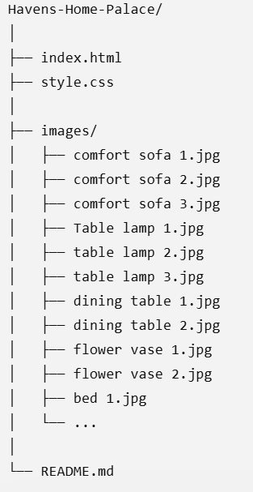
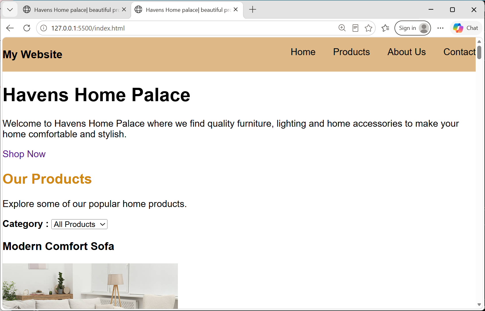
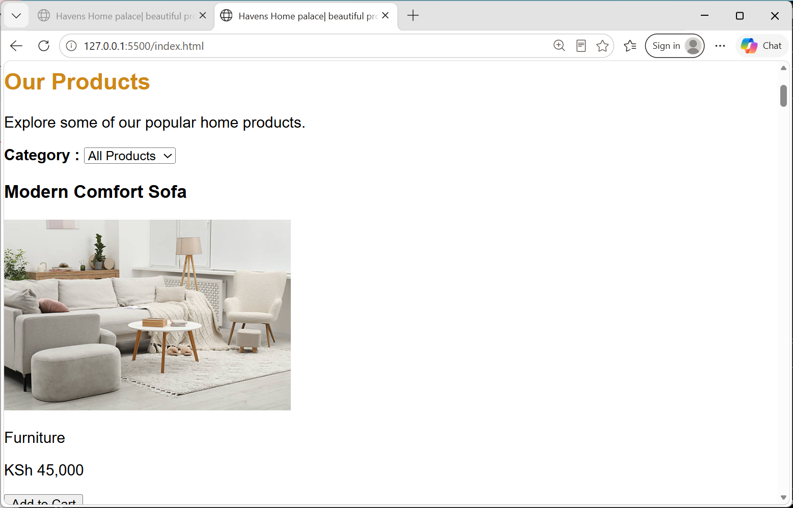
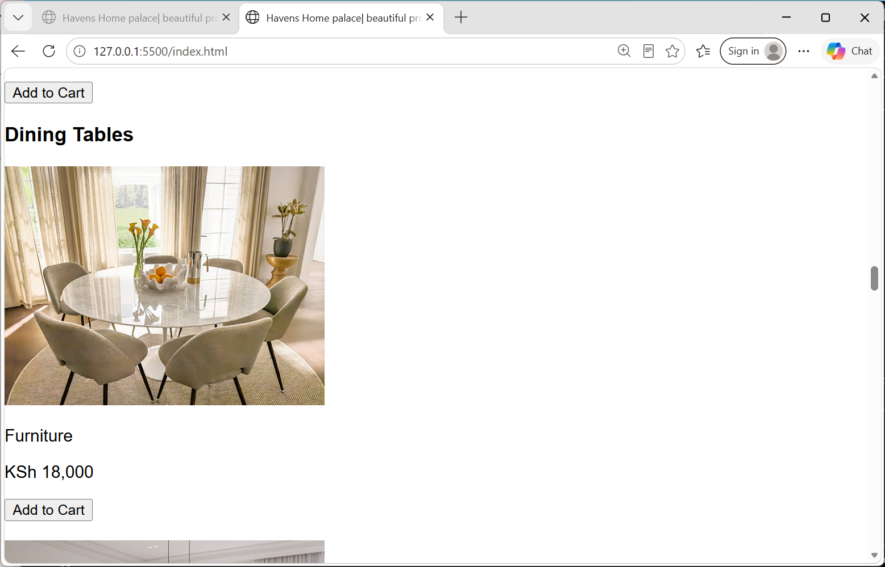

# Havens Home Palace

This is a website for Havens Home Palace, a home goods store located in Nairobi, Kenya.

The company provides quality furniture, lighting and home accessories to make homes comfortable and beautiful.

**live link**:https://github.com/mercymumbe/Havens_home_furniture.git

## Project Description

Havens Home Palace is a simple online home goods store website that allows customers to view different home products, their prices and categories.

The website includes products such as sofas, table lamps, dining tables, flower vases and modern beds.

## Business Role

The main goal of this website is to create an online presence for Havens Home Palace where customers can view our products and choose the home products they need.

## Features

1. Home page

This page gives a brief introduction to Havens Home Palace and includes a Shop Now button that takes users to the products section.

2. Products page

This section displays different products including furniture, lighting and home décor. Customers can also see the product prices and Add to Cart buttons.

3. About Us page

This section gives information about Havens Home Palace and explains our aim of providing comfortable, beautiful and affordable home products.

4.Contact page

This page provides the business phone number, email address and location in Nairobi, Kenya.

5.Shopping Cart

The website also has a shopping cart section where customers can view their selected products and total amount.

## Technologies Used

HTML5
CSS3
Git and GitHub for version control
Visual Studio Code
AI

## Project Structure

## Setup Instructions

### Run it on your computer
Clone the repository.

https://github.com/mercymumbe/Havens_home_furniture.git

Go into the project folder.

Search for Havens-Home-Palace

Open index.html in your browser (Chrome, Firefox or Safari).

You can also right-click index.html in VS Code and choose Open with Live Server.

## Deploy to GitHub Pages

Push the project to a GitHub repository.
In the repository, go to Settings → Pages.
Under Branch, choose main and the / (root) folder.
Click Save.
Wait a few minutes for the website to be published.

## Screenshots

## Author

Mercy Mutua, Zindua School, Web Development Fundamentals